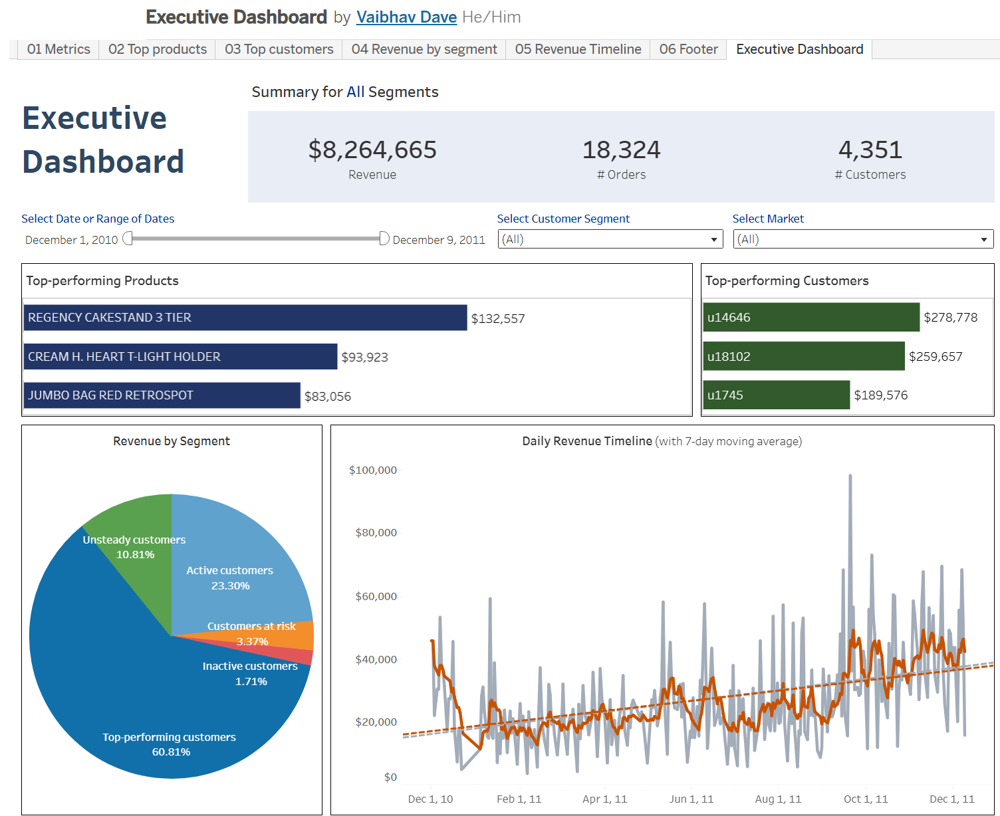

# E-Commerce Customer Segmentation & Insights

<div align="center">
  <p><strong>Advanced customer segmentation and analysis platform for e-commerce businesses</strong></p>
  <p>
    <a href="#overview">Overview</a> •
    <a href="#dataset-overview">Dataset Overview</a> •
    <a href="#features">Features</a> •
    <a href="#project-architecture">Architecture</a> •
    <a href="#installation">Installation</a> •
    <a href="#analysis-workflow">Analysis</a> •
    <a href="#visualizations">Visualizations</a> •
    <a href="#requirements">Requirements</a>
  </p>
</div>

## Overview

A comprehensive customer segmentation solution that analyzes e-commerce transaction data to derive actionable business insights. The project implements RFM (Recency, Frequency, Monetary) analysis using both statistical and machine learning approaches to segment customers and generate targeted marketing strategies.



[View Interactive Dashboard](https://public.tableau.com/views/ExecutiveDashboard_17455173540320/ExecutiveDashboard?:language=en-US&publish=yes&:sid=&:redirect=auth&:display_count=n&:origin=viz_share_link)

## Dataset Overview

The dataset is the output of the [RetailSync-ETL-Pipeline](https://github.com/VaibhavDaveDev/RetailSync-ETL-Pipeline.git) project where the raw online transactions data was extracted from Amazon Redshift warehouse, transformed and loaded to S3 cloud object. It contains 399,841 transaction records from 01/12/2010 to 09/12/2011.

### Data Attributes
- `invoice`: Invoice number
- `stock_code`: Product code
- `description`: Product description
- `price`: Unit price
- `quantity`: Quantity purchased
- `total_order_value`: Total transaction value
- `invoice_date`: Date and time of purchase
- `customer_id`: Unique customer identifier
- `country`: Country of customer

## Features

- **📊 Dual Segmentation Approach**: 
  - Percentile-based RFM analysis
  - K-means clustering
- **🔄 Complete ETL Pipeline**: 
  - Data extraction from Amazon Redshift
  - Comprehensive data preprocessing
  - Automated workflow
- **🎯 Marketing Strategy Generation**: 
  - Segment-specific campaign recommendations
  - Personalized customer engagement plans
- **📈 Advanced Analytics**:
  - Customer behavior analysis
  - Purchase pattern identification
  - Temporal trend analysis
- **📊 Interactive Visualizations**:
  - Customer segment distribution
  - Purchase patterns
  - RFM metric analysis

## Project Architecture

### Core Components
1. **Data Pipeline**
   - Source: Amazon Redshift warehouse
   - Processing: Python-based ETL
   - Storage: CSV and Pickle files

2. **Analysis Modules**
   - Data preprocessing and validation
   - Exploratory data analysis
   - RFM metric calculation
   - Customer segmentation
   - Marketing strategy generation

3. **Output Deliverables**
   - Segmented customer profiles
   - Marketing campaign strategies
   - Interactive visualizations
   - Actionable insights

## Installation

### Prerequisites
- Python 3.7+
- Python IDE or Text Editor
- Jupyter Notebook
- Required Python packages

### Setup Instructions

1. **Clone the Repository**
   ```bash
   git clone https://github.com/VaibhavDaveDev/E-Commerce-Customer-Segmentation-Insights.git
   cd E-Commerce-Customer-Segmentation-Insights
   ```

2. **Environment Setup**
   ```bash
   cp .env.example .env
   # Configure environment variables in .env
   ```

3. **Install Dependencies**
   ```bash
   pip install -r requirements.txt
   ```

## Analysis Workflow

### 1. Data Processing
- Handle missing values and duplicates
- Remove non-product transactions
- Process returns and cancellations
- Create date-based features

### 2. Customer Segmentation
- **RFM Analysis**:
  - Calculate recency, frequency, monetary metrics
  - Score customers on 3-9 scale
  - Generate segment labels

- **Machine Learning**:
  - Prepare data (scaling, transformation)
  - Apply K-means clustering
  - Validate results

### 3. Key Findings
- 38.79% Top-performing and active customers
- 27.03% Unsteady customers
- 34.18% At-risk and inactive customers
- Average customer spend: £1,829.95
- Peak business hours: 10 AM - 3 PM

## Visualizations

### Available Analytics
- Customer segment distribution
- Purchase patterns by time
- Geographic analysis
- RFM score distribution
- Customer value analysis

### Interactive Features
- Tableau dashboard integration
- Dynamic filtering
- Drill-down capabilities
- Export options

## Requirements

### System Requirements
- Python 3.7+
- 8GB RAM recommended
- Storage: 1GB minimum

### Python Libraries
- pandas
- numpy
- scikit-learn
- seaborn
- matplotlib
- yellowbrick

### Running the Project

1. **Using Python Scripts**
   ```bash
   python main.py
   ```

2. **Using Jupyter Notebooks**
   Run notebooks in sequence:
   - 1_data_preprocessing.ipynb
   - 2_exploratory_data_analysis.ipynb
   - 3_customer_segmentation_percentile_ranking.ipynb
   - 4_customer_segmentation_kmeans.ipynb

<div align="center">
  <p>
    <a href="https://github.com/VaibhavDaveDev/E-Commerce-Customer-Segmentation-Insights/stargazers">⭐ Star this repo</a> •
    <a href="https://github.com/VaibhavDaveDev/E-Commerce-Customer-Segmentation-Insights/issues/new">🐛 Report bug</a> •
    <a href="https://github.com/VaibhavDaveDev/E-Commerce-Customer-Segmentation-Insights/issues/new">✨ Request feature</a>
  </p>
</div>